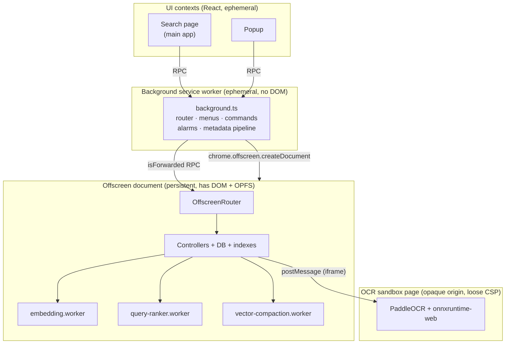
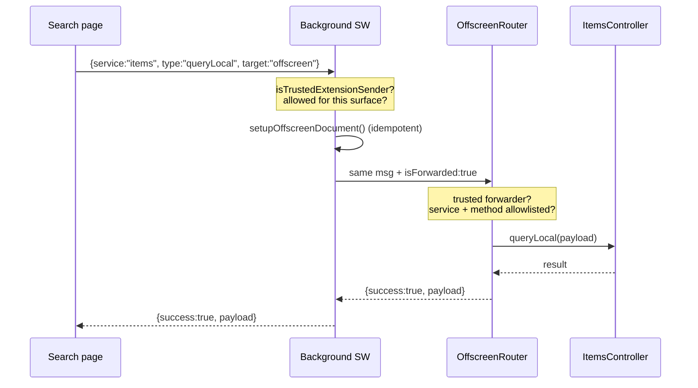
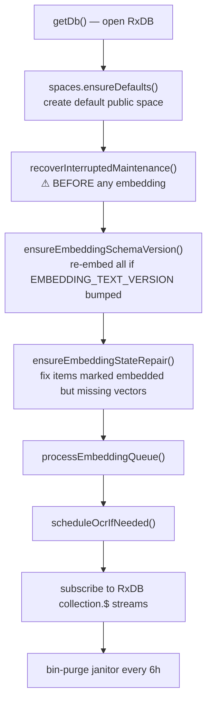
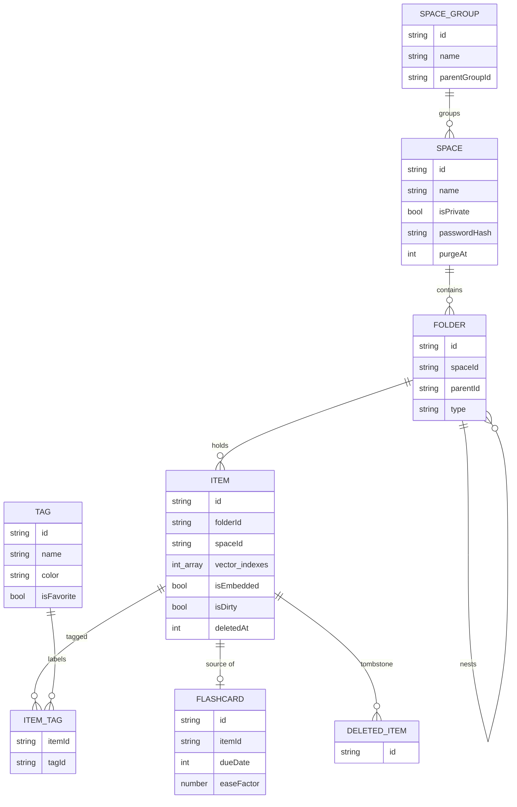
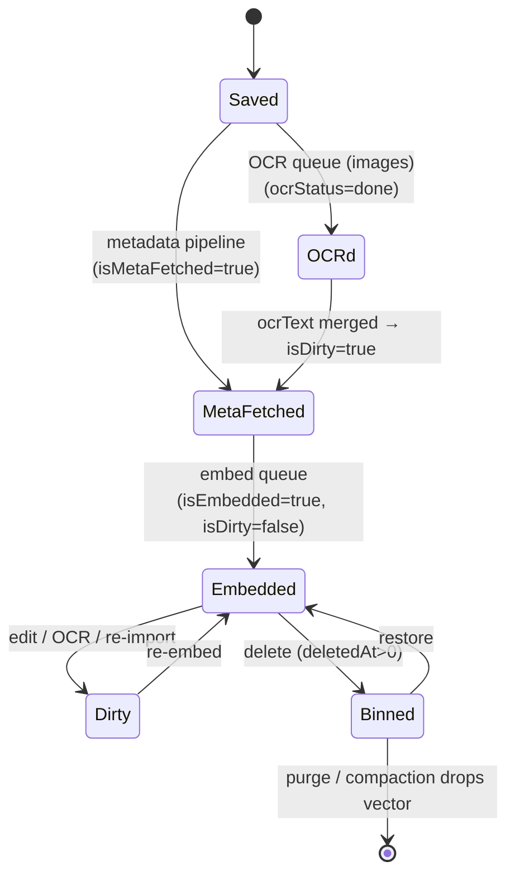

# Vibesearch — Architecture

This is the engineering companion to the [README](../../README.md). It explains how
Vibesearch is built: the execution contexts, how they talk, where data lives, and how each
subsystem works in detail.

If you only read one page, read this one — then jump to whichever subsystem you care about.

## Contents

| Doc | What it covers |
| --- | --- |
| **This page** | The big picture: contexts, message routing, startup, the data model |
| [workers.md](workers.md) | Every worker/context, why each exists, what runs where |
| [embeddings.md](embeddings.md) | The embedding model, text composition, batching, the embed queue |
| [vector-store.md](vector-store.md) | The custom on-disk vector DB: file format, CRUD, search, compaction |
| [search.md](search.md) | RxDB, the FlexSearch index, the query language, and hybrid ranking |
| [ocr.md](ocr.md) | On-device OCR in a sandboxed page (PaddleOCR) |
| [import.md](import.md) | Bookmarks, GitHub stars, the metadata pipeline, media storage |
| [backup-and-sync.md](backup-and-sync.md) | Sharing, JSON/Google Drive backup, migration, vector maintenance |

---

## The one-paragraph version

Vibesearch is a Manifest V3 browser extension. A thin **background service worker** owns the
Chrome APIs (context menus, commands, alarms, tabs, screenshots) and acts as a **router**. All
the heavy, stateful work — the database, the search indexes, embeddings, OCR — runs in a
long-lived **offscreen document**, because a service worker can be killed at any moment and
can't hold the file handles or workers this app needs. The OCR model runs in a separate
**sandboxed page** because its runtime needs CSP privileges the rest of the extension is
denied. The UI (the **search page** and **popup**) is a React app that never touches the
database directly — it asks the offscreen document over a message bus.

```
                                  ┌───────────────────────────┐
                                  │        The browser        │
                                  └───────────────────────────┘
        save / search / organize            │
   ┌───────────────────────┐                │  chrome.runtime messaging
   │   UI (React)          │                │
   │  • search page        │◀───────────────┼───────────────────────────────┐
   │  • popup              │                │                                │
   └───────────┬───────────┘                │                                │
               │ RPC ({service,type,payload, target:"offscreen"})            │
               ▼                                                             │
   ┌───────────────────────┐   chrome APIs   ┌──────────────────────────┐   │
   │  Background SW         │◀───────────────▶│  Chrome: tabs, menus,    │   │
   │  (router / orchestr.)  │   alarms etc.   │  commands, bookmarks,    │   │
   │  • context menus       │                 │  captureVisibleTab       │   │
   │  • commands/shortcuts  │                 └──────────────────────────┘   │
   │  • alarms (cron)       │                                                │
   │  • metadata pipeline   │──── fetch ───▶ metadata worker (Cloudflare)    │
   │  • NO db / NO vectors  │                                                │
   └───────────┬───────────┘                                                │
               │ forwards RPC (isForwarded:true)                            │
               ▼                                                            │
   ┌─────────────────────────────────────────────────────────────────┐    │
   │  Offscreen document  (the brain — persistent)                     │    │
   │                                                                   │    │
   │   OffscreenRouter ── dispatches ──▶ controllers:                  │    │
   │     items · folders · spaces · spaceGroups · tags · dbManager     │    │
   │     · sync · browserBookmarks · githubStars · ocr                 │    │
   │                                                                   │    │
   │   RxDB (Dexie/IndexedDB)        VectorStore (OPFS vectors.bin)     │    │
   │   FlexSearch index              vectorPipelineCoordinator (lock)   │    │
   │                                                                   │────┘
   │   spawns Web Workers:  embedding · query-ranker · vector-compaction │
   │   owns hidden iframe:   ── postMessage ──▶ OCR sandbox page          │
   └─────────────────────────────────────────────────────────────────┘
```

---

## The four execution contexts

Vibesearch deliberately splits work across four kinds of context. The split is forced by two
hard constraints of MV3 extensions: **service workers are ephemeral** (and have no DOM), and
the **Content Security Policy** is strict (no `unsafe-eval`, no `blob:` workers on extension
pages). Each context exists to live within — or around — those constraints.



### 1. UI — the search page and popup

React 19 apps. The **search page** (`src/pages/search/`) is the full library + search
experience and is a `web_accessible_resource` (it can be opened as a normal tab, including as
the new-tab page). The **popup** (`src/pages/popup/`) is the quick command palette from the
toolbar. UI code is **stateless with respect to data** — it sends RPC messages and renders what
comes back. It also runs one small worker of its own, the [query-assist worker](workers.md),
for autocomplete.

### 2. Background service worker — `src/workers/background.ts`

The only context allowed to touch most Chrome APIs. It builds the context menus, handles the
keyboard commands, runs the `chrome.alarms` "cron", captures screenshots, reads bookmarks, and
runs the **metadata pipeline** (fetching page titles/images). Critically, it has **no database
and no vector access** — for anything stateful it forwards an RPC to the offscreen document. It
is the security boundary: it authenticates senders and enforces which calls each UI surface is
allowed to make.

> **Why it owns so little state:** an MV3 service worker is torn down after ~30s idle and
> restarted on demand. Anything it held in memory would vanish. So it stays a stateless router.

### 3. Offscreen document — `src/pages/offscreen/offscreen.ts`

The brain. Created once via `chrome.offscreen.createDocument({ reasons: ["WORKERS"],
justification: "Persistent OPFS access for vector processing" })` and kept alive for the life of
the worker. It hosts:

- **RxDB** (the database) and the **FlexSearch** keyword index,
- the **VectorStore** (the custom vector DB backed by an OPFS file),
- all the **controllers** (`items`, `folders`, `spaces`, `tags`, …),
- the **embedding / OCR / sync** pipelines and the Web Workers they drive,
- a hidden **iframe** pointing at the OCR sandbox.

It needs to be an offscreen *document* (not the worker) because it requires a **DOM, OPFS, and
the ability to spawn module workers and an iframe** — none of which a service worker reliably
provides.

### 4. OCR sandbox — `src/pages/ocr-sandbox/`

A `manifest.sandbox` page with a deliberately looser CSP (`unsafe-eval`, `blob:` workers). It
exists solely to run the PaddleOCR runtime, which the normal extension CSP forbids. It has an
opaque origin and talks to the offscreen document via `postMessage`. See [ocr.md](ocr.md).

---

## How the contexts talk: the RPC bus

There is one uniform message envelope for all privileged calls:

```ts
{ service: "items", type: "queryLocal", payload: {...}, target: "offscreen", isForwarded?: true }
```

A UI surface sends `{ target: "offscreen" }`. The **background worker intercepts it**,
authenticates the sender, then **re-sends it with `isForwarded: true`**. The offscreen
document's `OffscreenRouter` (`src/services/router.ts`) only accepts forwarded messages from a
trusted forwarder, looks up `service`, checks `type` against that service's **method
allowlist**, and invokes it.



Three layers of authorization keep this safe (all in `background.ts` / `router.ts`):

- **`isTrustedExtensionSender`** — the message must come from this extension, and never from a
  tab/page pretending to be the worker.
- **`SEARCH_ONLY_OFFSCREEN_METHODS`** — sensitive calls (e.g. `spaces:unlockSpace`,
  `items:moveToSpace`) are only accepted from the search page.
- **`INTERNAL_ONLY_OFFSCREEN_METHODS`** — `items:saveFetchedMetadata` may only be invoked by the
  internal metadata pipeline, never by any page.

Separately, the offscreen document **broadcasts** `DB_CHANGE` and `PROCESS_STATUS` runtime
messages (no target) so the UI can reactively refresh and show background progress. `DB_CHANGE`
events are **coalesced on a 160ms timer** and **suppressed during bulk imports** so a 5,000-item
import produces one refresh, not 5,000.

---

## Startup sequence

When the offscreen document boots (`initializeApp` in `offscreen.ts`), order matters:



The reason crash recovery runs **before** embedding: an interrupted vector compaction can leave
the on-disk vector file and the database's index pointers disagreeing. New embedding work must
not append onto an inconsistent store. See [backup-and-sync.md](backup-and-sync.md#vector-maintenance).

The background worker registers the recurring **alarms** on install/startup:

| Alarm | Period | Triggers |
| --- | --- | --- |
| `embedding-alarm` | 5 min | drain the embed queue (`TRIGGER_EMBEDDING`) |
| `vector-sync-alarm` | 6 h | rebuild + compact the vector store (`sync:rebuildAndCompact`) |
| `metadata-retry-alarm` | 30 min | retry persisted failed metadata fetches |
| `opfs-promote-alarm` | 30 min | upload locally-stored media to durable R2 storage |

---

## The data model

Everything is RxDB (on top of Dexie → IndexedDB), database name `vibesearchdb`. Nine
collections:



| Collection | Role |
| --- | --- |
| `items` | The saved thing: tab, bookmark, note, image, screenshot. The central entity. |
| `folders` | Containers inside a space. `type` is `folder` or `tab_group` (a "tab group" is just a folder). Nestable via `parentId`. |
| `spaces` | Top-level scopes. Can be **private** (PBKDF2 password hash + recovery questions + auto-lock). Soft-deleted to a 30-day bin (`purgeAt`). |
| `space_groups` | Optional grouping of spaces in the sidebar; nestable (`parentGroupId`). |
| `tags` / `item_tags` | Tags (name, color, favorite) and the many-to-many join to items. |
| `flashcards` | Spaced-repetition cards (SM-2: `interval`, `easeFactor`, `dueDate`), optionally linked to an item. |
| `search_history` | Recent queries. |
| `deleted_items` | Tombstones for soft-deleted items (used to reconcile backups/sync). |

The **`items` schema** carries everything search needs in one document — `title`,
`textContent`, `ocrText`, `url`, `source`, media with per-image OCR metadata — plus the
machine-state flags that drive the pipelines:

| Flag | Meaning |
| --- | --- |
| `isMetaFetched` | Metadata enrichment done. **Admission gate for embedding.** |
| `isEmbedded` | A vector exists for this item. |
| `isDirty` | Content changed; needs re-embedding. |
| `vector_index` / `vector_indexes[]` | Row(s) in `vectors.bin`. Long items chunk into several. |
| `ocrStatus` | `pending` → `processing` → `done` \| `error` \| `skipped`. |
| `deletedAt` | `0` = live; non-zero = in the recycle bin. |

These flags are the thread that ties the whole system together — they are what the
[embedding queue](embeddings.md), the [OCR queue](ocr.md), and [vector maintenance](backup-and-sync.md#vector-maintenance)
poll for and advance. The item lifecycle:



---

## Where each concern lives (file map)

```
src/
├─ workers/background.ts ............ MV3 service worker: router, menus, commands, alarms,
│                                     metadata pipeline, screenshots, imports
├─ pages/
│  ├─ search/ ....................... main React app (Search.tsx, SearchQueryBar, Sidebar,
│  │   ├─ workers/query-assist.worker.ts   settings modal); query-assist worker
│  │   └─ search-preferences.ts            default mode/scope (localStorage)
│  ├─ popup/ ........................ toolbar popup
│  ├─ offscreen/offscreen.ts ........ the brain: router host, queues, RxDB subscriptions
│  └─ ocr-sandbox/ .................. sandboxed PaddleOCR page
├─ services/
│  ├─ router.ts ..................... OffscreenRouter (RPC dispatch + allowlists)
│  ├─ db-manager.ts ................. RxDB queue helpers, snapshots, OCR/embedding writes
│  ├─ DatabaseService.ts ............ RxDB setup + collections
│  ├─ local-search-index.service.ts  FlexSearch keyword/fuzzy/phonetic index
│  ├─ vector-store.service.ts ....... custom vector DB (vectors.bin)
│  ├─ vector-store/ ................. OPFS handler + dot product
│  ├─ vector-maintenance-journal.service.ts   crash-safe compaction journal
│  ├─ vector-pipeline-coordinator.ts  the embedding/compaction/OCR lock
│  ├─ embedding*.ts ................. embedding worker client/runtime/service
│  ├─ query-ranker.service.ts ....... query-ranker worker client
│  ├─ ocr.service.ts ................ OCR orchestration + sandbox client
│  ├─ metadata-pipeline.ts .......... URL → title/image/source pipeline
│  ├─ media-storage.ts .............. OPFS media + R2 promotion
│  ├─ share*.ts / sync.service.ts / google-workspace-sync.ts   share / backup / sync
│  ├─ controllers/ .................. items, folders, spaces, spaceGroups, tags
│  └─ workers/ ...................... embedding / query-ranker / vector-compaction workers
├─ search-core/ .................... PURE logic (no I/O): query-language, embedding-text,
│                                     hybrid-ranking, batching, pagination, contracts
└─ schemas/ ........................ RxDB JSON schemas (item, folder, space, …)
```

`search-core/` is worth calling out: it's intentionally free of `chrome`, DOM, and I/O so the
ranking math, query parser, and embedding-text rules can be unit-tested directly (`tests/`) and
shared verbatim between the UI, the workers, and the offscreen document.
