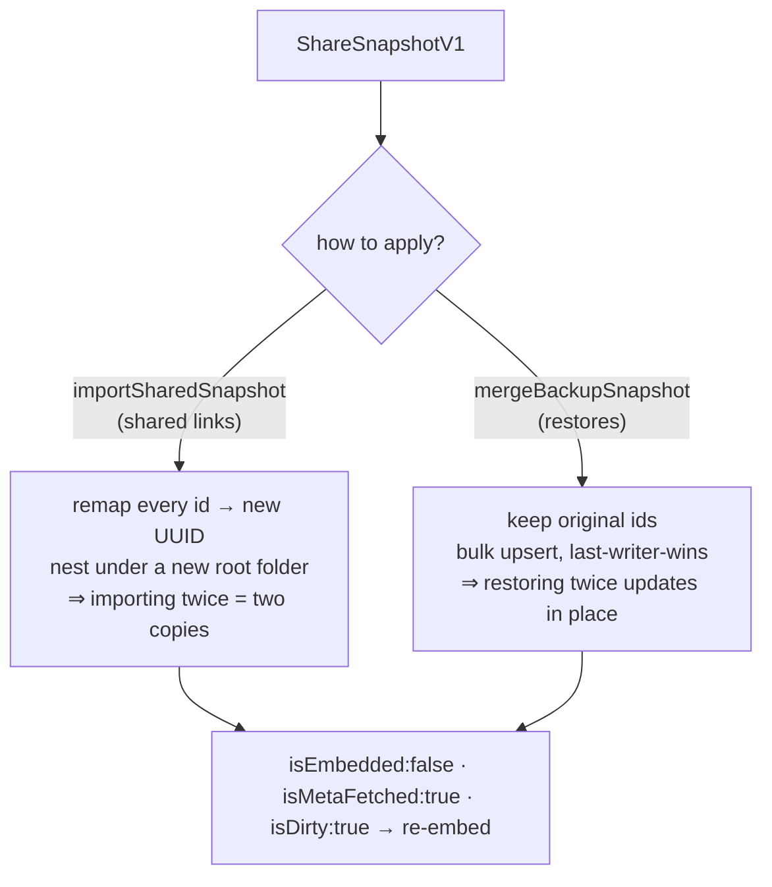
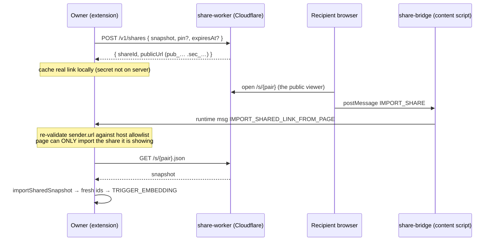
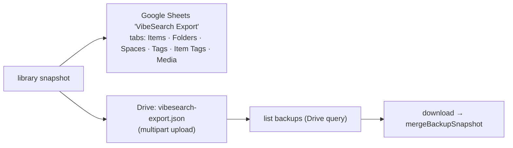
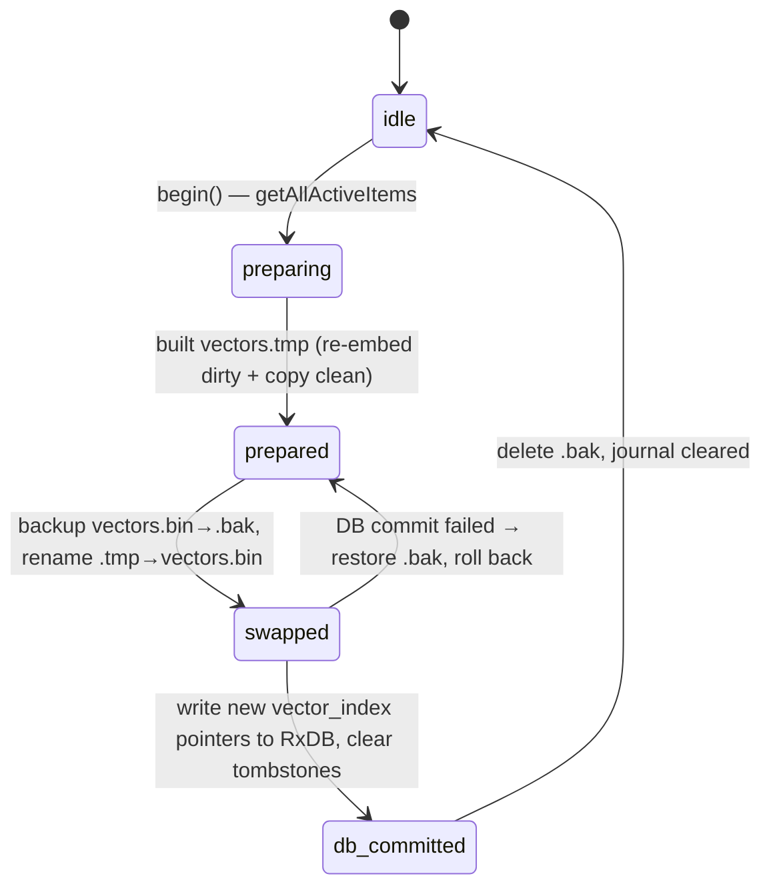
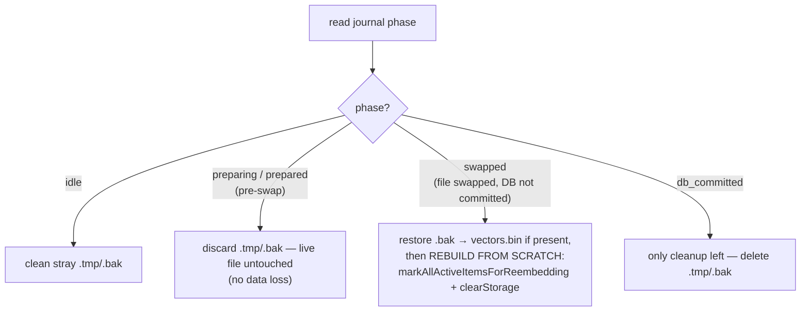

# Backup, Restore, Sharing & Vector Maintenance

This page covers everything about data leaving and re-entering Vibesearch — sharing a space as a
link, backing up to a file or Google Drive, migrating from an old install — plus the periodic
**vector maintenance** that keeps the store healthy. They're grouped together because they share
one governing rule.

> **The portability rule:** portable data **never** carries embedding vectors or credentials.
> Vectors are bound to one origin's OPFS file and can't be meaningfully moved; passwords are
> secrets. So anything that crosses a boundary (a share import, a backup restore, a migration) is
> reset to `isEmbedded:false, vector_index:-1` and **re-embedded locally** on arrival, and private
> spaces come back **public**. This keeps backups small, portable, and safe.

Implementation: `share-snapshot.ts`, `share.service.ts`, `content/share-bridge.ts`,
`sync.service.ts`, `vector-maintenance-journal.service.ts`, `google-workspace-sync.ts`,
`google-auth.ts`, `local-extension-migration.ts`, plus `db-manager.ts` snapshot glue.

## The snapshot — one portable format

A `ShareSnapshotV1` is the common currency for sharing and backup. It's a plain JSON tree:

```
ShareSnapshotV1
├─ schemaVersion: 1
├─ source        { kind: "folder"|"folders"|"items", ids[] }
├─ spaceGroups[] { id, name, sortOrder, isCollapsed }
├─ spaces[]      { id, name, slug?, spaceGroupId?, isPrivate? }      ← no password material
├─ folders[]     { id, name, spaceId?, parentId?, type }
├─ items[]       { id, title, textContent, ocrText, url, source, media?, … }   ← no vectors
├─ tags[]        { id, name, color? }
├─ itemTags[]    { itemId, tagId }
└─ warnings[]    { code, itemId?, detail? }
```

`sanitizeMedia` enforces the portability rule for binaries: **OPFS-only media can't be exported**
(`MEDIA_OPFS_SKIPPED` warning) — it must be promoted to R2 first (see
[import.md](import.md#media-storage-opfs-then-r2)), so a shared link's images resolve for the
recipient. Per-image OCR internals (`sourceHash`, `modelVersion`) are stripped.

### Two ways to apply a snapshot

The same snapshot can be imported with two very different semantics:



- **`importSharedSnapshot`** (a shared link) mints fresh UUIDs and nests everything under a new
  root folder, so importing the same link twice gives you two independent copies.
- **`mergeBackupSnapshot`** (a restore) keeps original ids and upserts with **last-writer-wins**
  (`if existing.updatedAt > source.updatedAt: skip`), so re-running a restore updates records
  instead of duplicating folders. Private spaces are restored public (no credentials in
  backups); orphaned folders are remapped to the public space.

---

## Sharing

You can share a space, folder, or selection as a link. The design goal is a **capability URL**:
holding the link is the authorization, and the server never holds enough to reconstruct it.

### The link & the secret

```
share link:   https://share.vibesearch.app/s/pub_<id>.sec_<secret>
                                               └── public id ──┘ └── secret ──┘
```

- The **secret is part of the URL and is never stored server-side** — the worker keeps only a
  hash. So even the owner's "my shares" list can't reconstruct a working link; the creating
  device caches the real link locally (`shareLinksByShareId`) for re-copying.
- An **owner token** (`vshr_owner_…`, generated client-side, stored only in
  `chrome.storage.local`, never in the database) authenticates owner operations.
- Optional **PIN** (travels in an `x-share-pin` header) and **expiry**; shares are **revocable**.



The **share-bridge** content script (injected only on the share hosts) is how a web page asks the
extension to import. Its security model is tight: the page can only ask to import **the share it
is currently displaying** — the background reads Chrome's trusted `sender.url`, re-validates it
against the host allowlist, and ignores any page-supplied URL. Owner operations
(`createShare`, `listOwnedShares`, `revokeShare`, `setSharePin`, `updateShareSnapshot`, analytics)
live in `share.service.ts` against `/v1/shares`.

---

## Backup & restore

### JSON export / import

`buildExportSnapshot` (→ `buildLocalExportSnapshot`) produces a whole-library `ShareSnapshotV1`;
importing it runs through `mergeBackupSnapshot`. Simple, portable, no account.

### Google Drive (+ Sheets)

Opt-in, via Settings → Connectors → Google. OAuth uses `chrome.identity.getAuthToken` with a
`launchWebAuthFlow` fallback (`drive.file` + `spreadsheets` scopes). `syncSnapshotToGoogleWorkspace`
writes the same snapshot to **two** destinations:



State (spreadsheet id, drive file id, last sync) is kept in `chrome.storage.local`
(`vs_google_workspace_sync_v1`); a stale id that 404s triggers recreate. Restore lists the JSON
backups in Drive and merges the chosen one.

### Migrating from an older local extension

`local-extension-migration.ts` handles a **full** transfer (distinct from the portable snapshot):
a self-contained bundle with **every** RxDB collection dump **plus the OPFS media bytes
base64-encoded**. On restore, collections are bulk-upserted in batches, media is rehydrated into
OPFS, and — per the portability rule — items are reset to re-embed. Large bundles are staged in
memory by `stageId` with a TTL so a giant JSON blob isn't retained longer than the restore.

### The restore-metadata queue

Restored/imported items may predate metadata enrichment (no title/image/source). After any
restore, `collectMetadataPendingUrls()` selects the un-enriched, fetchable http(s) URLs and
`queueMetadataForRestoredItems()` hands them to the background `FETCH_METADATA` pipeline —
**fire-and-forget**, so the restore never blocks on the network. From there it's the normal
[metadata → embedding chain](import.md).

---

## Vector maintenance

The vector store is append-only, so edits and deletes leave [orphaned vectors](vector-store.md#update--delete--deferred-to-compaction).
Every **6 hours** (`vector-sync-alarm`) — and on demand — `sync.service.ts`'s `rebuildAndCompact`
reclaims them: it drops deleted items' vectors, re-embeds dirty ones, and writes a fresh, dense
`vectors.bin`.

The catch: swapping the OPFS file and updating the database's index pointers are **two
operations that aren't atomic together**. A crash between them would leave on-disk vectors and
in-DB `vector_index` pointers disagreeing — silent wrong results. A **write-ahead journal**
(an RxDB local document, `vector-maintenance-journal`) makes the whole thing crash-safe.

### Files & phases

```
vectors.bin  ← the live store          journal phases:
vectors.tmp  ← the rebuilt store        idle → preparing → prepared → swapped → db_committed → idle
vectors.bak  ← backup during swap
```



The dangerous instant is **`swapped`**: the file is the new one, but the DB still points at the
old layout.

### Crash recovery

On every offscreen startup — **before any new embedding** — `recoverInterruptedMaintenance()`
reads the journal and acts on the phase it finds:



The `swapped` case is the conservative one: because the file and the DB pointers can no longer be
trusted to agree, it throws the vectors away and **re-embeds the whole active library** rather
than risk serving mismatched results. Everything else is a clean, no-data-loss abort. This is
also why recovery runs *before* the embedding queue — new appends must never land on an
inconsistent store. See [vector-store.md](vector-store.md#durability--consistency).

### The pipeline lock

Compaction can't run while embedding is appending. The
[`vectorPipelineCoordinator`](embeddings.md#one-batch-end-to-end) makes `embedding` and
`compaction` **mutually exclusive**, with OCR yielding to both:

```
priority:  compaction  >  embedding  >  OCR
```

---

## Summary

| Operation | Mechanism | Vectors? | Credentials? | Idempotent? |
| --- | --- | --- | --- | --- |
| Share a space/folder | capability URL `pub_….sec_…`, secret client-only | re-embedded on import | none | no (fresh copies) |
| JSON / Drive backup | `ShareSnapshotV1` | re-embedded on restore | none (private→public) | restore via merge (yes) |
| Restore | `mergeBackupSnapshot` (last-writer-wins) | re-embedded | none | yes |
| Migrate old install | full RxDB + OPFS bytes bundle | re-embedded | none | yes (upsert) |
| Vector compaction | `rebuildAndCompact` + WAL journal | rebuilt in place | n/a | crash-recoverable |
