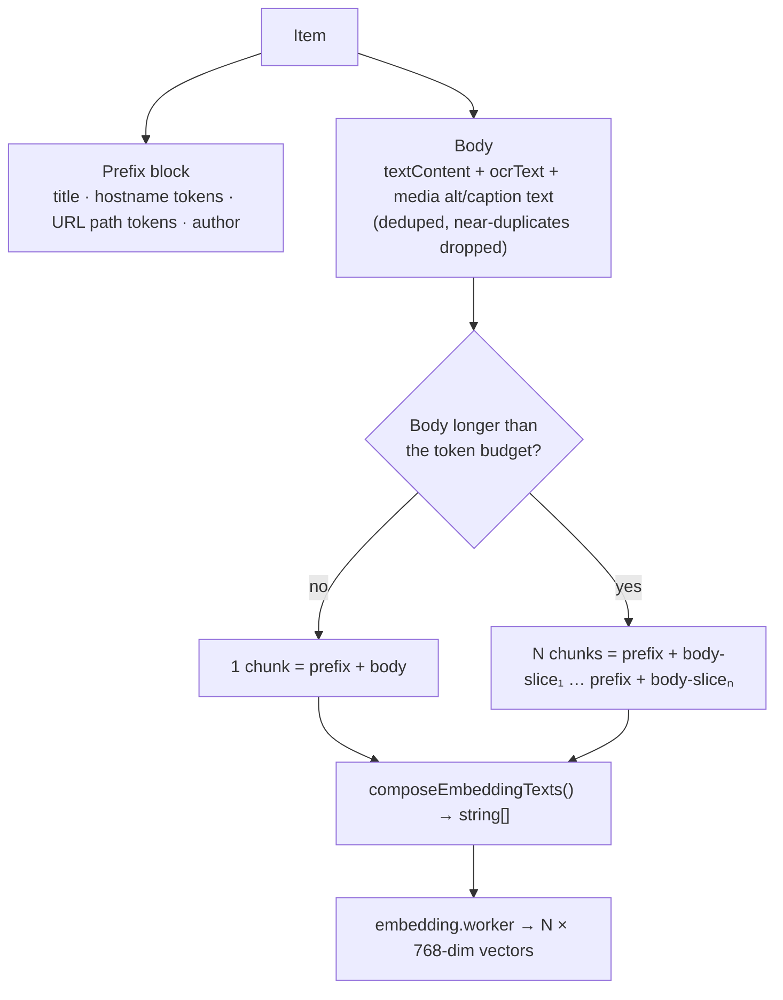
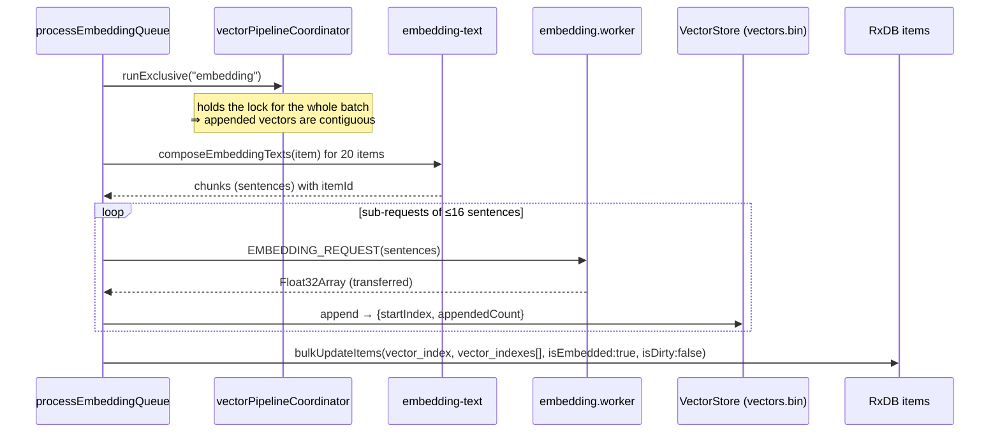
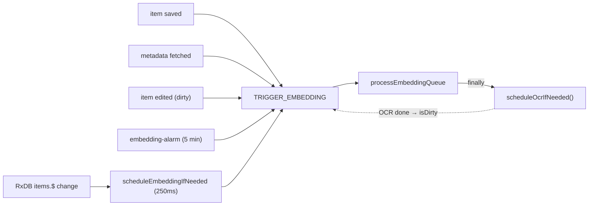

# Embeddings

Semantic search is the headline feature, and it's powered by an embedding model that runs
**entirely on the user's machine**. This page covers the model, how text is turned into vectors,
how inference is batched to stay within a browser's memory, and the queue/state machine that
keeps the library embedded as it changes.

The companion page [vector-store.md](vector-store.md) covers where those vectors are *stored* and
how they're *searched*. This page is about *producing* them.

## The model

| | |
| --- | --- |
| **Model** | `onnx-community/mdbr-leaf-ir-ONNX` (an ONNX export of MongoDB's `mdbr-leaf-ir`) |
| **Type** | Asymmetric information-retrieval (IR) sentence transformer |
| **Output** | `sentence_embedding`, **768-dimensional**, L2-normalized |
| **Runtime** | `@huggingface/transformers` (transformers.js) on onnxruntime-web, **WASM**, fp32 |
| **Where it runs** | A dedicated [`embedding.worker`](workers.md#embeddingworker--srcservicesworkersembeddingworkerts) inside the offscreen document |

A few decisions worth understanding:

- **Why read `sentence_embedding` directly (AutoModel) and not the feature-extraction
  pipeline?** This ONNX graph bakes in the full sentence-transformers head: *mean pooling →
  a 384→768 Dense projection → L2 normalize*. The feature-extraction pipeline would mean-pool
  `last_hidden_state` and skip the Dense/Normalize layers, producing the wrong vectors. So the
  worker runs `AutoModel` and reads the `sentence_embedding` output.
- **Why fp32 only?** Retrieval quality, and so every vector in the index comes from the exact
  same numerical model. Mixing quantizations would make cosine scores incomparable.
- **Why served from the project's R2 bucket, not Hugging Face?** HF serves ONNX weights as Git
  LFS files that **302-redirect to a rotating CDN host**. Under the extension's strict
  `connect-src` CSP that's brittle (and rate-limited). The project mirrors the model to its own
  Cloudflare R2 bucket and serves it through the metadata worker's stable `/r2/<key>` path,
  which is already CSP-allowlisted and returns the bytes directly with CORS. (See
  `embedding-worker-runtime.ts`.)
- **Why constrain the ONNX runtime?** `numThreads = 1`, `proxy = false`, `useWasmCache = false`.
  The extension CSP has no `blob:` for `worker-src`, and MV3 can't grant one — so ORT must not
  spin its own blob-backed proxy/threads, and its WASM must load from a same-origin URL. The
  worker reuses the asyncify WASM that OCR already ships, avoiding a second copy.

> Changing the model's dimension is a breaking change: `VECTOR_DIMENSION = 768` is written into
> the vector file header, and a mismatch automatically resets the on-disk store
> (see [vector-store.md](vector-store.md)).

---

## From an item to vectors

A saved item is messy — a title, scraped text, OCR text from images, a URL, an author. Turning
that into good embeddings is the job of `search-core/embedding-text.ts`, which is **pure,
versioned, and unit-tested**.

### Query/passage asymmetry

`mdbr-leaf-ir` is an *asymmetric* model: **queries** get a retrieval prompt prefix, **documents**
don't. Both land in the same vector space.

```
Query:    "Represent this sentence for searching relevant passages: cooling data centers"
Document: "Seawater cooling for hyperscale data centers
           hostname tokens · path tokens · author
           <body text…>"
```

Forgetting this prefix is a classic IR bug — it quietly degrades every result. It lives in one
place (`QUERY_EMBEDDING_PROMPT`) and is applied only on the query path.

### Composition & chunking

Documents are composed **content-first, with no field labels**. `source` and media *type* are
deliberately **left out** of the embedding text — they're hard filters elsewhere, and repeating
tokens like "youtube" on every document inflated baseline similarity and collapsed result
separation.



- The model has a **hard 512-token context** (BERT). Each composed chunk is kept comfortably
  under it (`chunkTextByTokenBudget`), splitting on paragraph boundaries first, then words, so
  long passages embed without silent tail-truncation.
- A long article therefore becomes **several vectors**, all sharing the prefix. The item records
  them in `vector_indexes[]`. At search time the item's score is the **best** cosine across its
  chunks — so a hit deep in a long page still surfaces the whole item.
- Character caps keep any one field from dominating: `title` 220, `textContent` 2200,
  `ocrText` 12000, media text 6000, query 320.

### Versioning — `EMBEDDING_TEXT_VERSION`

The composition rules are stamped with a version (currently `v7-mdbr-leaf-ir-media-text`). On
startup the offscreen document compares it to the stored version; if it changed, it calls
`markAllActiveItemsForReembedding()` and the whole library re-embeds in the background. This is
how the embedding text can be improved without leaving stale vectors behind.

---

## Bounding memory: length-aware micro-batches

Transformer self-attention memory scales with `batchSize × paddedSeqLen²`. One naïve unbounded
batch — padded to its longest member — is what makes a bulk import spike to multiple gigabytes
and crash the tab. `search-core/embedding-batching.ts` (`planLengthAwareBatches`) prevents that
two ways:

1. a hard cap of **8 sentences per inference pass** (`MICRO_BATCH_MAX_SENTENCES`), and
2. a **padding-aware cap** on `count × longestWeightInBatch`.

Sentences are bucketed by length (largest first), so a pass never mixes one very long sequence
with many short ones and pays full padding for all of them.

```
Unbounded (bad):  [s, s, s, LONG, s, s] → all padded to LONG's width → huge
Length-aware:     [LONG, long]                  pass 1   (few, wide)
                  [med, med, med, med]          pass 2   (medium)
                  [s, s, s, s, s, s, s, s]      pass 3   (many, narrow)
                  → padded width stays local to each pass
```

The query path embeds a single sentence, so it's unaffected — search stays fast.

---

## The embedding queue

Embedding is a **background, self-healing queue**, not something the save path waits on. The
offscreen document owns it (`processEmbeddingQueue` in `offscreen.ts`).

### What gets embedded, and when

Two database queries feed the queue (in `db-manager.ts`):

| Query | Selector | Meaning |
| --- | --- | --- |
| `getItemsToEmbed` | `isEmbedded:false, isMetaFetched:true, deletedAt:0` | brand-new items |
| `getDirtyItems` | `isDirty:true, isMetaFetched:true, deletedAt:0` | content changed → re-embed |

Note the shared gate: **`isMetaFetched:true`**. An item won't embed until its metadata
enrichment has run, so its title/description are present in the vector (see
[import.md](import.md)). New items are drained first, then dirty ones, 20 items per batch.

### One batch, end to end



Two subtleties:

- **The coordinator lock.** `vectorPipelineCoordinator.runExclusive("embedding", …)` holds the
  lock across the *entire* batch. Because nothing else can append meanwhile, the vectors a batch
  writes land at **contiguous indices**, which is what lets each item record a simple
  `[startIndex … startIndex+n]` range.
- **Bounded sub-requests (≤16 sentences).** A batch is fed to the worker in slices so a big,
  OCR-heavy batch can't monopolize the worker for seconds — an interactive search request slips
  in between slices — and so each OPFS append stays small.

### Triggers, debounce, and the closed loop

The queue is poked from many places but always converges:



That last edge is the **screenshot → OCR → re-embed loop**: embedding finishes and re-checks the
OCR backlog; when OCR extracts text it merges it into the item and marks it dirty, which
re-triggers embedding. A screenshot you just took becomes semantically searchable on its own
text without you doing anything. (OCR and embedding never run at once — see the priority lock in
[ocr.md](ocr.md#concurrency--backpressure).)

### Self-healing on startup

Before the queue runs, the offscreen document repairs known bad states:

- **`ensureEmbeddingSchemaVersion`** — re-embed everything if `EMBEDDING_TEXT_VERSION` changed.
- **`ensureEmbeddingStateRepair`** — `repairItemsMissingVectors()` finds items flagged
  `isEmbedded:true` but with no usable vector (e.g. an interrupted write) and resets them so the
  queue re-embeds them.

---

## Why this design

| Goal | Mechanism |
| --- | --- |
| Never block saving | Embedding is an async background queue keyed off DB flags |
| Never freeze the UI/offscreen thread | Inference runs in a dedicated worker |
| Never OOM on bulk import | Length-aware micro-batches + bounded sub-requests |
| Keep search snappy during imports | Interactive queue jumps ahead of background |
| Survive crashes & model/text changes | Startup repair + version-triggered re-embed |
| Keep vectors consistent | Coordinator lock ⇒ contiguous appends; metadata gate before embed |
