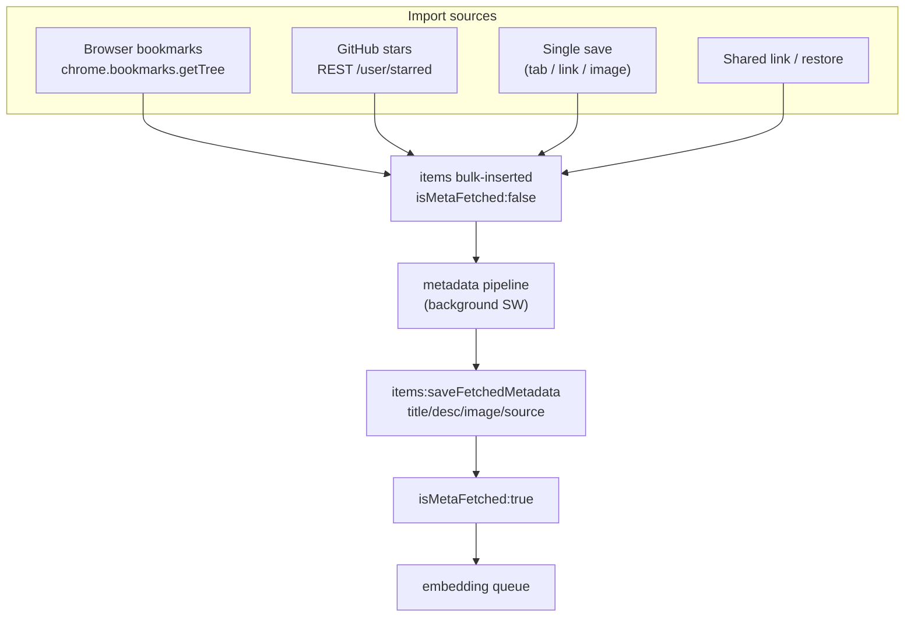
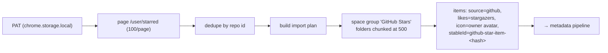
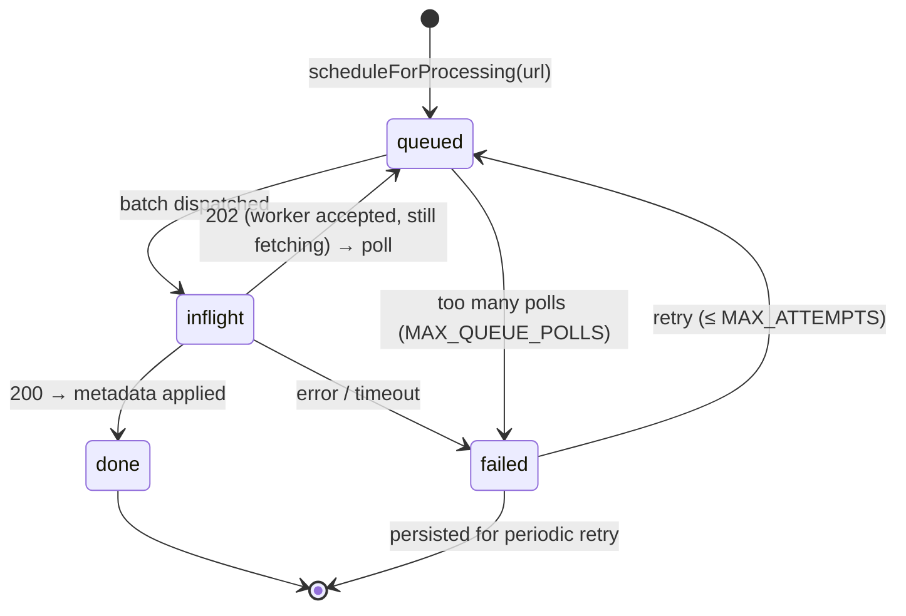
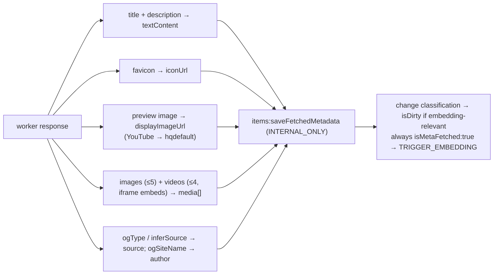
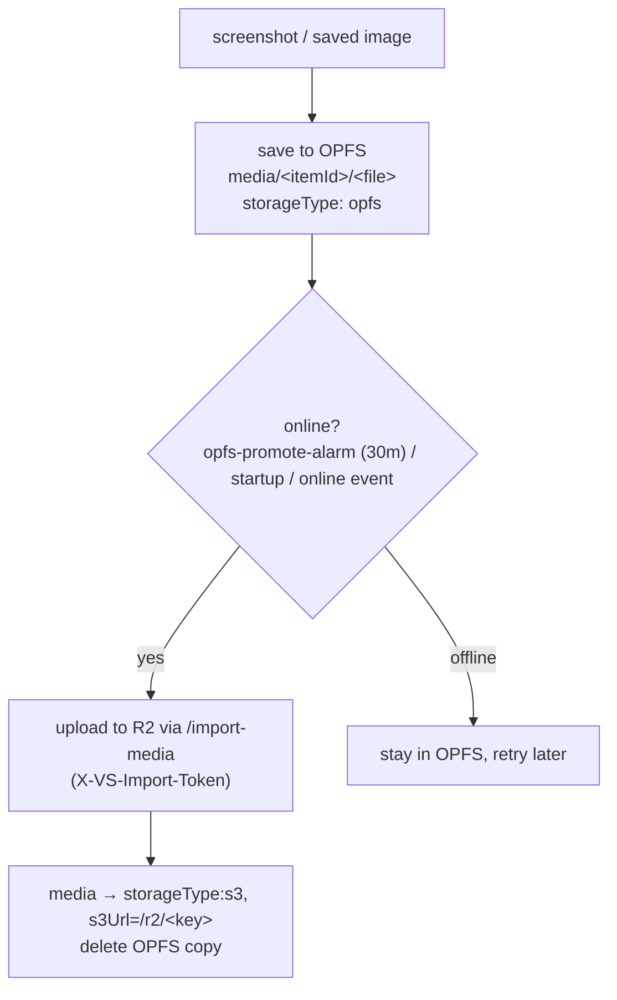
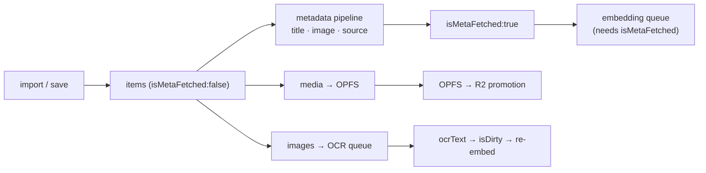

# Import, Metadata & Media

Getting things *into* Vibesearch — a single saved tab, ten thousand imported bookmarks, your
GitHub stars — and then enriching them with titles, descriptions, and preview images is a
multi-stage, rate-aware, crash-resistant pipeline. This page covers the import sources, the
metadata pipeline that powers rich previews, and how media (images/screenshots) is stored.

Implementation: `browser-bookmark-import.ts`, `github-stars-import.ts`, `github-stars-api.ts`,
`metadata-pipeline.ts`, `media-storage.ts`, `utils/infer-source.ts`, `utils/media-embed.ts`.

## The shape of an import

Every import path lands items in the database **un-enriched** (`isMetaFetched:false`) and then
hands their URLs to the metadata pipeline, which enriches them in the background; enrichment in
turn unblocks [embedding](embeddings.md).



---

## Browser bookmarks

Triggered from Settings → Data. The background worker reads the whole tree with
`chrome.bookmarks.getTree()` and forwards it to the offscreen importer.

- **Tree → spaces/folders.** The bookmark hierarchy is flattened with an iterative DFS that
  carries folder ancestry. Loose top-level URLs are gathered into a synthetic **"Unsorted
  bookmarks"** folder. Nested bookmark folders become nested Vibesearch folders.
- **Chunking.** Any folder is capped at **500 items** (`MAX_BOOKMARKS_PER_SPACE`); overflow rolls
  into additional folders so no single container grows unbounded.
- **Idempotent re-import.** Each entity gets a **stable id** derived from a hash
  (`browser-{space|folder|bookmark}-<hash>`), and `updateBookmark`/`updateFolder` return "no
  change" when nothing differs — so re-importing updates in place instead of duplicating. A URL
  change resets `isMetaFetched` so the item re-enriches. Folders over 300 items start collapsed.
- **Source inference.** Each bookmark's `source` is guessed from its host via `inferSource`.

## GitHub stars

Requires a **GitHub personal access token** (read-only is enough), saved locally in
`chrome.storage.local`. The background worker pages the REST API:

```
GET https://api.github.com/user/starred?per_page=100&page=N&sort=created&direction=desc
    Authorization: Bearer <token>   Accept: application/vnd.github+json
```



Repos become items with `source: "github"`, `likes` set to the stargazer count, and the owner
avatar as the icon. The importer also **reconciles**: stars you've since un-starred are
soft-deleted, and stable ids keep a re-import idempotent.

---

## The metadata pipeline

This is the engine behind rich previews. Given a batch of URLs, it fetches each page's title,
description, preview image, author, and source from the project's **metadata worker**
(`metadata-worker.watermelons.workers.dev`), then writes the results back onto items. It's a
hand-rolled, persistent, rate-aware queue in `metadata-pipeline.ts` (running in the background
worker).

### Per-URL state machine



The subtlety that makes bulk imports work: **HTTP 202 is not a failure.** The worker throttles
per-domain; a 202 means "accepted, fetching behind a throttle." The pipeline polls those
patiently. Counting still-queued work as "failed" was historically why a big import reported most
links as failures — so queued URLs increment a separate `pollCount` (cap **15**), distinct from
hard-failure `attempts` (cap **3**).

### Throughput, backoff, and persistence

| Knob | Value | Why |
| --- | --- | --- |
| `CONCURRENCY` | 4 | parallel in-flight requests |
| `BATCH_SIZE` | 20 | URLs per worker request |
| `TICK_INTERVAL` | 250 ms | coalesce bursts into batches |
| `RETRY_BACKOFF` | 2s, 15s, 60s (+ jitter) | spread retries, avoid thundering herd |
| GET→POST switch | query > 12,000 chars | long URL batches go in the body |
| `FETCH_TIMEOUT` | 15 s | abort hung requests |

Hard failures are **persisted** to `chrome.storage.local` (`vibesearch:metadata:failed-v1`) with
a `nextRetryAt`, and re-tried by the **30-minute `metadata-retry-alarm`** plus on startup — so the
queue survives the service worker being killed and the browser restarting.

### What gets written



`saveFetchedMetadata` is an **internal-only** RPC (no page can call it). It merges results with
[change classification](search.md): a changed `title`/`textContent`/`authorUsername` marks the
item dirty (those are part of the embedding text); a changed `source` does **not** (it's a hard
filter, not embedded). It always sets `isMetaFetched:true` — even on permanent failure — so a
card never waits forever, and then triggers embedding. Domain-specific field preferences
(`metadataPreferences.ts`) decide which OG/Twitter tags win (e.g. Instagram prefers Twitter
tags).

---

## Media storage: OPFS, then R2

Saved images and screenshots are binary, so they don't live in the database. They go to **OPFS**
first (instant, offline, local), then are **promoted to durable cloud storage (Cloudflare R2)**
in the background.



- **Three storage types** on each media entry: `hotlink` (just the remote URL — no copy stored),
  `opfs` (bytes in the local file system), `s3` (promoted to R2). Limits per item: 5 images,
  5 GIFs, 4 videos.
- **Why promote at all?** OPFS can be cleared with site data, isn't shareable, and isn't backed
  up. Promotion to R2 makes media durable, shareable (a [share](backup-and-sync.md#sharing)
  refuses OPFS-only media), and backup-able. Promotion is **online-gated** and idempotent.
- **The upload token** (`X-VS-Import-Token`) is injected at build time
  (`scripts/ensure-import-media-token.mjs`) and must match the worker's token; uploads fail
  loudly if it's missing.
- **Embeds** (e.g. YouTube) are normalized to worker-proxied embed URLs (`media-embed.ts`) and
  rendered in sandboxed iframes.

### Source inference — one source of truth

`utils/infer-source.ts` maps a hostname to a `source` (the single source of truth for every save
path): `x.com`/`twitter.com` → `twitter`, `youtube.com`/`youtu.be` → `youtube`, plus `reddit`,
`instagram`, `tiktok`, `substack`, `linkedin`, `github`, `medium`/`dev.to` → `article`, else
`web`. The metadata pipeline may later override this with the page's actual OpenGraph type.

---

## How it all chains together



Four background pipelines — **metadata, embedding, media promotion, OCR** — all keyed off the
same item flags, all idempotent, all resumable. That's what lets you paste in 10,000 bookmarks,
close the tab, and come back to a fully enriched, fully searchable library.
