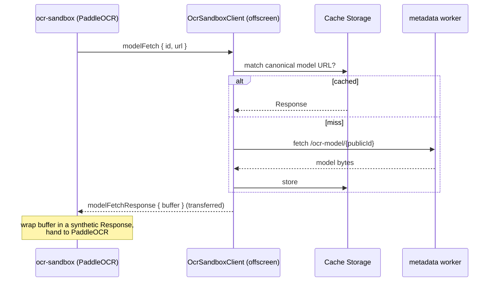
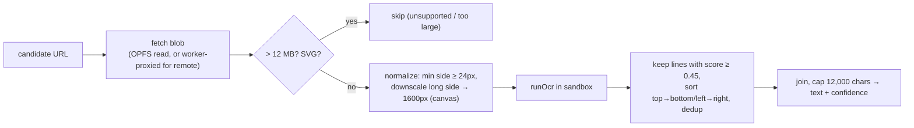
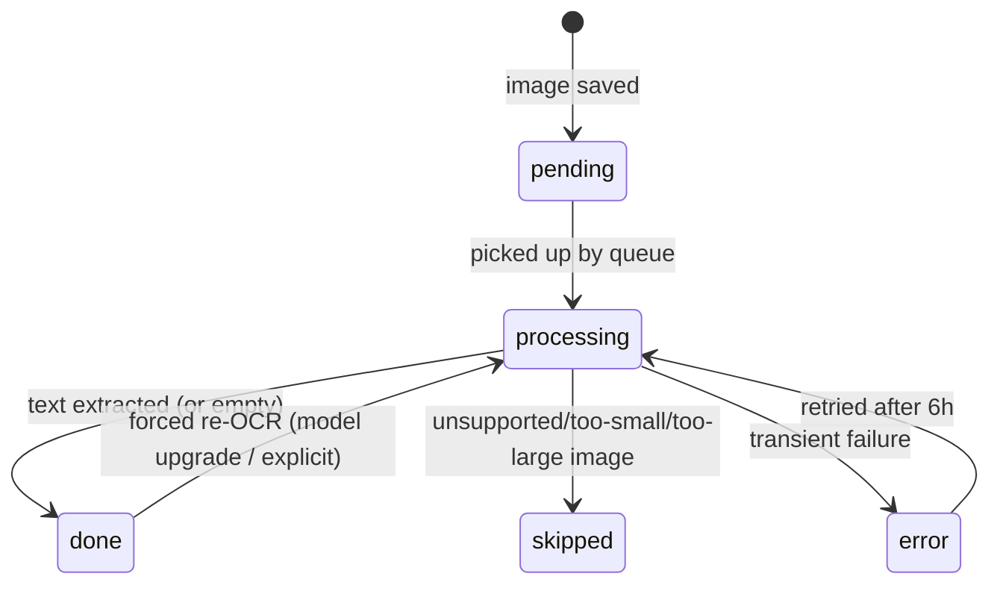
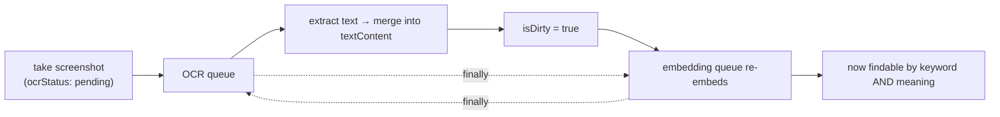

# OCR — reading text inside images

Screenshots and saved images aren't just pixels in Vibesearch — their text is extracted and
folded into the item so it becomes searchable. OCR runs **entirely on-device** with PaddleOCR.
This page explains the unusual four-layer structure (and the CSP reason it has to exist), the
model, the message protocol, and how extracted text loops back into search.

Implementation: `src/services/ocr.service.ts`, `src/pages/ocr-sandbox/`,
`src/services/ocr-model-config.ts`, `src/services/ocr-text.ts`, OCR queue in `offscreen.ts`.

## The four layers

```
┌──────────────────────────────────────────────────────────────────────────┐
│ offscreen.ts — OCR queue & state machine                                   │
│   processOcrQueue() · ocrStatus transitions · writes results to RxDB       │
└───────────────┬────────────────────────────────────────────────────────────┘
                │ ocrService.processItem(item)
                ▼
┌──────────────────────────────────────────────────────────────────────────┐
│ OcrService — candidate selection, image fetch + normalize, result merge    │
└───────────────┬────────────────────────────────────────────────────────────┘
                │ OcrSandboxClient.request(runOcr)
                ▼
┌──────────────────────────────────────────────────────────────────────────┐
│ OcrSandboxClient (in offscreen DOM) — owns hidden iframe, model-fetch proxy │
│   Cache Storage "vibe-search-ocr-models-v1"                                 │
└───────────────┬────────────────────────────────────────────────────────────┘
                │ postMessage("*") + authenticate via event.source
                ▼
┌──────────────────────────────────────────────────────────────────────────┐
│ ocr-sandbox page (manifest sandbox, opaque "null" origin, loose CSP)        │
│   @paddleocr/paddleocr-js → onnxruntime-web (WASM, SIMD, single-thread)     │
└──────────────────────────────────────────────────────────────────────────┘
```

```mermaid
flowchart TB
    Q["OCR queue<br/>(offscreen.ts)"] --> SVC["OcrService<br/>candidates · fetch · normalize"]
    SVC --> CL["OcrSandboxClient<br/>iframe + model cache"]
    CL <-->|postMessage| SBX["ocr-sandbox page<br/>PaddleOCR + ORT"]
    CL -->|model bytes (proxied)| MW["metadata worker /ocr-model/&lt;id&gt;"]
    SVC --> DB[("RxDB items")]
```

## Why a sandboxed page (the whole reason this is complicated)

PaddleOCR's onnxruntime-web runtime needs two things the extension's normal CSP forbids:

| Capability needed by ORT | Extension-pages CSP | Sandbox CSP |
| --- | --- | --- |
| `eval` for the WASM glue | `script-src 'self' 'wasm-unsafe-eval'` → **no `unsafe-eval`** | `'unsafe-eval'` ✅ |
| blob-backed Web Workers | `worker-src 'self'` → **no `blob:`** | `worker-src 'self' blob:` ✅ |

So OCR **cannot** run in the offscreen document or the popup (strict CSP), and it **cannot** run
in the service worker either (no DOM, no `createImageBitmap`/canvas, no iframe). A
`manifest.sandbox` page is the only context with the privileges PaddleOCR's runtime requires.

The price of the sandbox is an **opaque origin** (`"null"`). Its origin can't be matched, so both
sides `postMessage(..., "*")` and authenticate the peer by checking `event.source` (the iframe's
`contentWindow` on one side; the sole parent on the other). Targeting a concrete origin silently
drops every message — which is exactly the bug the code comments warn about (a 30s "sandbox did
not initialize" timeout).

## The model & how it loads

| | |
| --- | --- |
| **Engine** | `@paddleocr/paddleocr-js` (PaddleOCR) on onnxruntime-web |
| **Models** | `PP-OCRv6_small_det` (text detection) + `PP-OCRv6_small_rec` (recognition) |
| **Version** | `OCR_MODEL_VERSION = "pp-ocrv6-small-…"` (stamped on every result for idempotency) |
| **ORT** | `backend: "wasm"`, SIMD on, single-thread, proxy disabled |

Model bytes are addressed by an opaque `publicId` and served from the metadata worker at
`/ocr-model/<publicId>`. But the **sandbox's `connect-src` can't reach that host** (and it's an
opaque origin), so it never fetches the model itself:



The parent does the real fetch (its `connect-src` allows the worker), caches it in **Cache
Storage** (`vibe-search-ocr-models-v1`), and ships the bytes into the sandbox as a transferred
`ArrayBuffer`. So the model downloads **once**, then loads from cache forever.

## The message protocol

Two envelopes, distinguished by `target`; all binary payloads use Transferables.

| Direction | `target` | Messages |
| --- | --- | --- |
| parent → sandbox | `vibe-search-ocr-parent` | `runOcr { id, imageBuffer, … }`, `modelFetchResponse { id, buffer }` |
| sandbox → parent | `vibe-search-ocr-sandbox` | `ready`, `modelFetch { id, url }`, `response { id, items }` |

Requests are correlated by `id` through a `pending` map. Timeouts: **30s** for first init, **180s**
per OCR request, **120s** per model fetch. An init **circuit breaker** (2 failures → 60s cool-off)
prevents hammering a broken runtime.

## Candidate selection — which image gets read

An item can carry several media plus a display image. `OcrService.getImageCandidates` picks at
most **3** (`MAX_IMAGES_PER_ITEM`), in a priority that prefers the most authoritative local copy:

```
priority:  opfs  >  s3  >  original (hotlink)  >  displayImageUrl
           (a locally-stored screenshot/upload beats a remote hotlink)
```

Each candidate is then prepared before OCR:



**Idempotency:** a stable FNV hash (`getSourceHash`) over the model version + image source means
an item already OCR'd at the current model version and same source is skipped — re-running the
queue is cheap and safe.

## The queue & state machine

OCR is a background queue (`processOcrQueue` in `offscreen.ts`), batch size **1** (one image-set
at a time — OCR is heavy and there's a single sandbox). `ocrStatus` is the per-item state:



`getItemsToOcr` selects items with `ocrStatus ∈ {pending, processing, error}` and an OCR-able
image, where `error` items are only retried after a **6-hour** gate.

### Concurrency & backpressure

OCR is the **lowest-priority** background job. The
[`vectorPipelineCoordinator`](embeddings.md#one-batch-end-to-end) gives:

```
priority:  compaction  >  embedding  >  OCR
```

`maybeReportOcrWait()` makes OCR defer (re-checking in 5s) while embedding or vector maintenance
is active, so reading images never steals cycles from search-critical work.

## The closed loop: screenshot → OCR → re-embed

When OCR finishes, `saveItemOcrResult` (in `db-manager.ts`) merges the extracted text into the
item's `textContent` via `appendOcrTextToTextContent` (which skips the append if the text is
already present), and — crucially — sets `isDirty:true, isEmbedded:false`. That marks the item
for re-embedding, so its image text becomes part of its **semantic** vector, not just the keyword
index.



The two queues poke each other in their `finally` blocks, so a freshly-saved screenshot gets
read and re-embedded promptly instead of waiting on a timer. See
[embeddings.md](embeddings.md#triggers-debounce-and-the-closed-loop).

## Two granularities of result

A single OCR pass produces **both**:

- an **item-level** aggregate (`ocrText`, confidence, line count) merged into `textContent` and
  used for search, and
- **per-media** OCR metadata written onto each `media[].ocr` entry (engine `paddleocr`, model
  version, source hash, extracted text) — so the UI can show the text of a specific image.

There's also an **ad-hoc route**: the `ocr` service exposes `extractImageText({ url })` for
one-off OCR of a single image URL (e.g. "Extract text from image" in the context menu), which
runs the same `processCandidates` path without persisting to an item.
