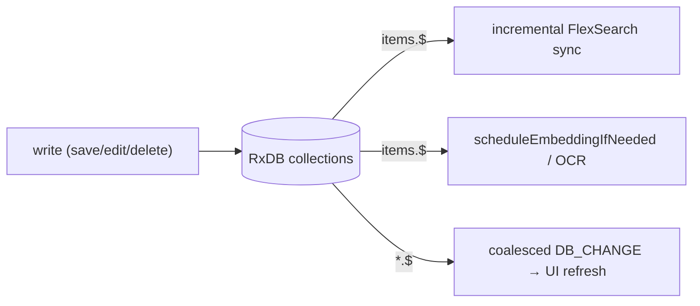
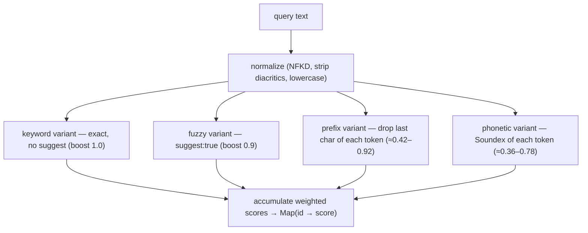
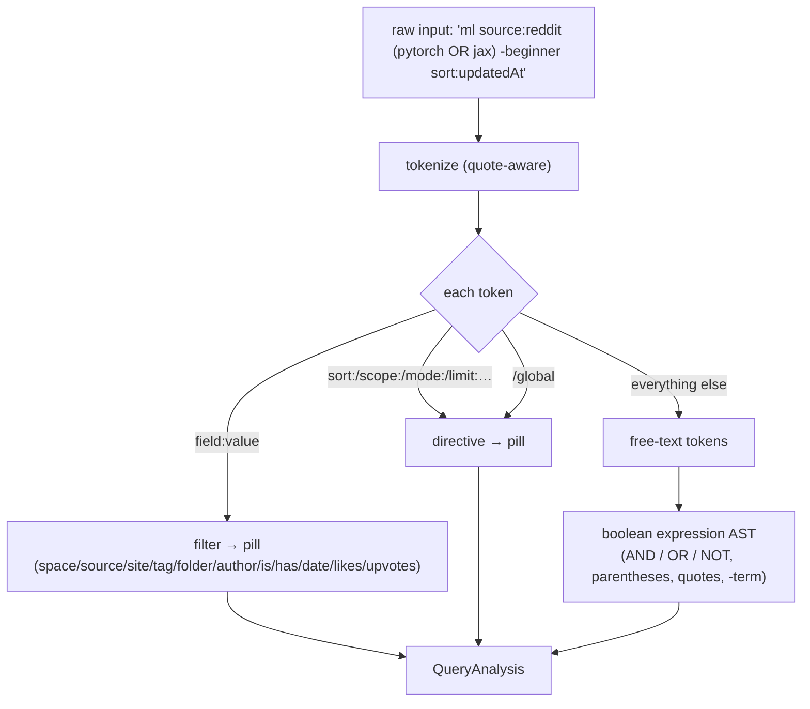
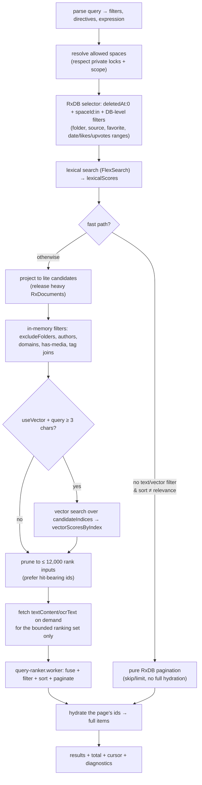

# Search — RxDB, FlexSearch, the query language & hybrid ranking

Search is where everything comes together. A single query runs through a parser, the database,
a keyword index, the vector store, and a ranking worker — then comes back as a ranked,
paginated page of items. This page walks the whole path.

The pieces:

- **RxDB** (`DatabaseService.ts`, `db-manager.ts`) — the reactive database and filtering.
- **FlexSearch** (`local-search-index.service.ts`) — the keyword / fuzzy / phonetic index.
- **The query language** (`search-core/query-language.ts`) — turns your text into filters,
  directives, and a boolean expression.
- **Hybrid ranking** (`search-core/hybrid-ranking.ts` + `query-ranker.worker.ts`) — fuses
  lexical and vector signals into one relevance.
- **The conductor** (`items.controller.ts` → `queryLocal`) — orchestrates all of the above.

---

## RxDB: the reactive database

RxDB sits on top of Dexie (→ IndexedDB), database `vibesearchdb`. It's chosen for two
properties the app leans on hard:

- **Reactive change streams.** Every collection exposes a `.$` observable. The offscreen
  document subscribes to these to drive incremental search-index sync, embedding/OCR triggers,
  and coalesced `DB_CHANGE` broadcasts to the UI. Save an item anywhere and the index, the
  vectors, and every open view converge automatically.
- **Schema + migrations.** Each collection has a JSON schema with indexes; RxDB runs migration
  strategies on version bumps (e.g. space groups gained `parentGroupId`, tags gained
  `color`/`isFavorite`).



Filtering uses RxDB **selectors** (Mango-style queries) against indexed fields — `deletedAt`,
`spaceId`, `source`, `folderId`, `createdAt`, `updatedAt`, `isFavorite`, etc. The only `count()`
in the app is the 500-items-per-folder cap, which needs a multi-field selector that can't use a
single index — hence `allowSlowCount: true` (it's bounded and rare, so a slow count is fine).

---

## FlexSearch: keyword, fuzzy & phonetic

The lexical half of search is a FlexSearch `Document` index, built from all non-deleted items.
Each item is normalized into a multi-field document, and **fields are weighted** so a title hit
counts for more than a body hit:

```
title 6.0   tagsText 4.5   textContent 3.0   ocrText 2.8   url 2.5
author 2.5  phoneticTitle 2.0   phoneticAuthor 1.5   source 1.0
```

### Three flavors of match, one index

`buildVariants()` turns one typed query into several index lookups, each with a boost:



- **Keyword** is exact and never silently becomes fuzzy OR-matching.
- **Fuzzy** turns on FlexSearch `suggest`, plus a **prefix** variant (drop the last character, so
  "kuber" matches "kubernetes") and a **phonetic** variant.
- **Phonetic** is real *sounds-like* matching: each item's title and author are pre-encoded with
  **Soundex** into `phoneticTitle` / `phoneticAuthor` fields, and the query is Soundex-encoded
  the same way. So "shoomer" can find "Schumer".

Each field's contribution is `weight × variantBoost / (rank + 1)`, accumulated per item id into
a `Map<id, score>`. One guardrail: **OCR text is keyword-only** — the fuzzy/phonetic variants
skip it, because noisy image-extracted text otherwise pollutes fuzzy results.

### Staying in sync without rebuilding

A full rebuild of a big library is expensive, so the index maintains itself incrementally:

- RxDB `items.$` changes feed `scheduleItemSync(changedIds)`, **debounced 220ms**.
- Incremental sync removes+re-adds just the changed ids (or, with no ids, everything touched
  since the last sync). A pending **full rebuild always supersedes** queued per-item work —
  important during bulk imports, where holding thousands of ids would just waste memory.
- Build progress is surfaced to the UI via `PROCESS_STATUS` messages.

---

## The query language

The parser (`analyzeQuery` in `search-core/query-language.ts`) runs in the
[query-assist worker](workers.md#query-assistworker) on every keystroke. It splits your input
into three things: **structured filters**, **directives**, and **free-text** — and emits
**pills** (the chips you see) plus autocomplete **suggestions**.



| Category | Examples |
| --- | --- |
| **Filters** | `space:` `source:` `site:`/`domain:` `tag:` `folder:` `author:` `is:favorite` `has:image\|video\|media\|embed` |
| **Dates** | `added:today\|yesterday\|last7d\|last30d`, `added:on:/after:/before:/between:`, `>=`/`>`/`<=`/`<`, `D..D`, `YYYY-MM-DD` (`date`/`added`/`created` filter saved time; `updated` filters last change) |
| **Numbers** | `likes:` `upvotes:` with `>=N`, `N..M`, exact `N` |
| **Directives** | `scope:` (`current`/`global`/`private`/`public`, shorthand `/global`), `sort:` (`relevance`/`createdAt`/`updatedAt`/`title`/`source` + `asc`/`desc`), `mode:` (`keyword`/`vector`/`fuzzy` + `+` blends), `minscore:`/`score:`, `limit:`/`page:` |
| **Free text** | everything else; supports `AND`/`OR`/`NOT`, parentheses, `\|`/`\|\|`, `&`/`&&`, `"quoted phrases"`, and `-term` to exclude |

Any filter can be **negated** with a leading `-` (`-source:twitter`). Filters AND together; free
text is parsed into a boolean AST. Two derived forms are produced — a structured AST (for
expression evaluation) and flat `groups`/`excludedTerms` (for scoring) — both consumed by the
ranker. The full user-facing reference is in the [README](../../README.md#search-like-a-pro).

### Mode & scope resolution

A query's effective **mode** and **scope** resolve in three layers (so a power user can override
per query without changing their defaults):

```
typed directive (mode:/scope: in the query)
        ↓ falls back to
session chip override (the chips on the search bar)
        ↓ falls back to
saved default (Settings → Search; localStorage)   default = Hybrid (keyword+vector) / Everywhere
```

---

## Hybrid ranking

When both lexical and vector signals are on (the default "Hybrid"), they must be combined. The
**how** matters a lot.

### Why not Reciprocal Rank Fusion?

The app used to fuse with RRF (rank-based). RRF throws away *how strong* each match is: a junk
document that merely contains a query keyword lands at lexical rank ~1 and inherits a near-top
fused score, while a semantically excellent document with no keyword overlap is capped low. That
made hybrid *worse* than pure vector search.

### Weighted, normalized magnitudes

Now the signals are fused by **normalized magnitude**, with vector weighted higher
(`search-core/hybrid-ranking.ts`):

```
vector_norm  = clamp01(cosine)                 # ReLU+clamp keeps 0.7 at 0.7,
                                               # collapses near-orthogonal to ~0
lexical_norm = clamp01(lexicalScore / maxLexicalScore)

relevance    = 0.7 * vector_norm + 0.3 * lexical_norm     # HYBRID_VECTOR/LEXICAL_WEIGHT
```

- A keyword coincidence can contribute **at most 0.3**, so it can no longer outrank a strong
  semantic match — but documents strong in *both* channels still score highest.
- A `VECTOR_HIT_FLOOR = 0.15` treats near-orthogonal neighbors as "no vector hit", trimming the
  long tail without dropping real matches.
- Vector-only and lexical-only modes use their single signal (lexical-only adds a small
  term-coverage boost so exact multi-term matches beat single-term partials).
- A small **recency** term breaks ties so, all else equal, fresher items edge ahead.

### Where fusion runs — `query-ranker.worker`

The fusion + filter + sort + paginate step is CPU-bound over potentially thousands of
candidates, so it runs in the [`query-ranker` worker](workers.md#query-rankerworker). It
receives the candidate items plus two score maps (`lexicalScores` by id, `vectorScoresByIndex`
by vector index), computes each item's relevance, keeps the top window with a **min-heap**, and
returns a page of ids + a cursor. An in-process `rankLocally` mirrors it exactly as a fallback.

---

## The `queryLocal` pipeline

`ItemsController.queryLocal` is the conductor. It's heavily optimized so that large libraries
stay fast and don't balloon memory. The throughline: **narrow cheaply in the database first,
hold only lightweight projections, and fetch heavy text only for the handful of items that reach
ranking.**



The memory-conscious choices, made explicit:

- **Fast paths skip ranking entirely.** The default "open this space" view (no text, no vector,
  sort by date) becomes plain RxDB pagination — it must not hydrate the whole library to show
  the first page.
- **Lite projections.** When ranking *is* needed, candidates are projected to a small shape and
  the heavy RxDocuments are released immediately; retaining every in-scope document with its full
  text is what made big libraries memory-heavy.
- **Candidate-restricted vector search.** Only the filtered items' `vector_indexes` are scanned
  (see [vector-store.md](vector-store.md#candidate-restricted-search)).
- **On-demand text.** `textContent`/`ocrText` is fetched only for the bounded ranking set
  (≤12,000, capped to ~6,000 chars each), since text is only needed for boolean evaluation and
  the lexical fallback.
- **Cursor pagination** keyed by a stable `queryHash`, so paging is consistent and the cursor is
  ignored if the query changed. Timeouts (lexical 4s, vector 3.5s) degrade gracefully rather than
  hanging the query.

---

## Putting numbers to a hybrid query

```
"cooling data centers source:arxiv.org added:last30d"

  parse        → filters {domain: arxiv.org, dateFrom: …}; free text "cooling data centers"; mode hybrid
  DB selector  → deletedAt:0, spaceId in {allowed}, createdAt ≥ 30d ago         → ~120 candidates
  FlexSearch   → keyword+fuzzy over the query                                    → lexicalScores{…}
  in-mem       → keep only domain == arxiv.org                                   → ~40 candidates
  vector       → embed query (cached), scan those 40 items' vectors             → vectorScoresByIndex{…}
  rank worker  → relevance = 0.7*cos + 0.3*lex, recency tie-break, top-K heap   → ranked page
  hydrate      → load the 20 ids on this page                                    → items[]
```

The query did one model inference, scanned ~40 vectors, and only ever loaded the full text of
the items that reached the page — not the whole library.
