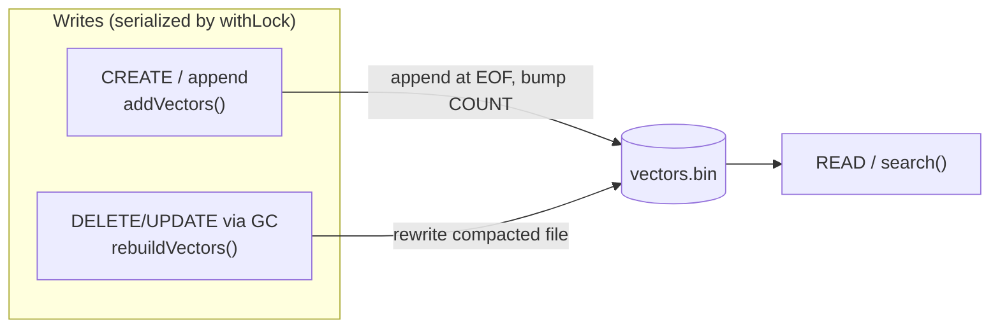
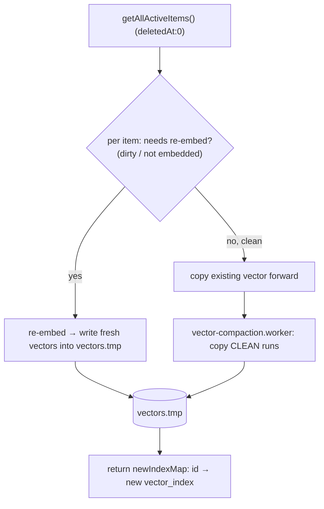
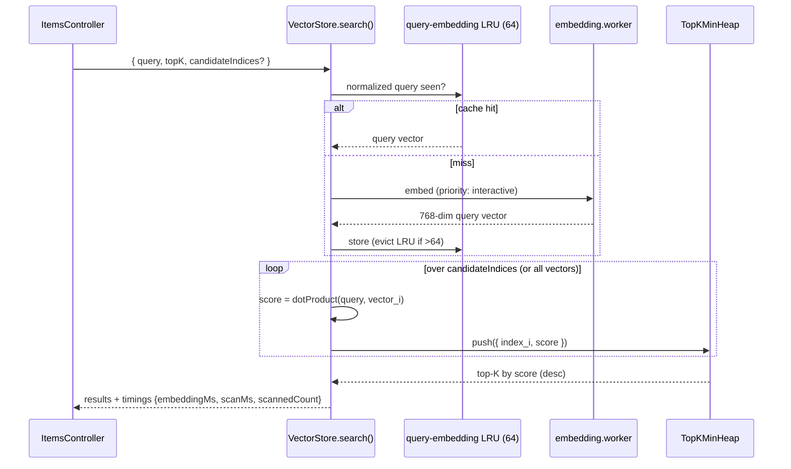

# The Vector Store — a custom on-disk vector DB

Vibesearch doesn't use an off-the-shelf vector database. It ships a small, purpose-built one:
a single binary file in the browser's **Origin Private File System (OPFS)**, plus an in-memory
mirror, plus a brute-force cosine scan. This page explains the file format, every CRUD
operation, how search works, and — the part people ask about — **why brute force is the right
call here and how it stays fast.**

Implementation: `src/services/vector-store.service.ts`, `src/services/vector-store/opfs-handler.ts`,
`src/services/vector-store/dot-product.ts`. Vectors are *produced* by the
[embedding pipeline](embeddings.md); this page is about storing and querying them.

## Why build one at all?

A browser extension can't run a server-side vector DB, and shipping a WASM index (HNSW/IVF)
would add megabytes and complexity. The actual requirements are modest:

- vectors are **768-dim, L2-normalized fp32**, produced locally;
- a typical library is **thousands to tens of thousands** of vectors;
- writes are **append-heavy** (you save things over time);
- it must survive the service worker dying and the tab closing.

For that shape, a **flat file + linear scan** is simpler, smaller, debuggable, and — as the
numbers below show — fast enough that the bottleneck is embedding the query, not scanning.

---

## The file format: `vectors.bin`

One file in OPFS. A 16-byte header, then tightly-packed `Float32` vectors, row-major.

```
 byte
 offset   field            type        value / meaning
 ───────  ───────────────  ──────────  ─────────────────────────────────────
   0..3   MAGIC            uint32 LE   0x56494245  = ascii "VIBE"
   4..7   VERSION          uint32 LE   1
   8..11  DIMENSION        uint32 LE   768   (must match VECTOR_DIMENSION)
  12..15  COUNT            uint32 LE   number of vectors stored
 ───────  ───────────────  ──────────  ─────────────────────────────────────
  16..     vector[0]        f32 × 768   3072 bytes
  3088..   vector[1]        f32 × 768   3072 bytes
   …        …
           vector[COUNT-1]
```

```
        ┌──────────── 16-byte header ────────────┐┌──── body: COUNT × 3072 bytes ────┐
        │ MAGIC │ VER │ DIM=768 │   COUNT          ││ v0 (3072B) │ v1 │ v2 │ … │ vN-1  │
bytes:  0       4     8         12        16        16+0         …
        └─ "VIBE"                                  └─ vector i lives at 16 + i*3072
```

- **`vector i` lives at byte `16 + i × 768 × 4`.** The integer `i` is the item's
  `vector_index` — a direct offset, no index structure needed to fetch a vector by id.
- **Self-describing & self-healing.** On open, the header is validated. A wrong MAGIC throws; a
  `DIMENSION` mismatch (you changed models) or a body size that doesn't equal
  `COUNT × 768 × 4` (corruption / partial write) **resets the file** rather than serving garbage.

### OPFS access — `OpfsHandler`

A thin async wrapper over the OPFS file handle:

- **read(offset, len)** = `file.slice(offset, offset+len).arrayBuffer()` — reads any byte range.
- **write(offset, buffer)** = `createWritable({ keepExistingData: true })` then write at a
  position — so appends and header rewrites don't rewrite the whole file.

OPFS is used (not IndexedDB) because it gives **random-access byte I/O** over a large binary blob
— exactly what a packed vector file wants — and it's available in workers/offscreen documents.

### In-memory mirror — segments

On load, the body is read into memory once. Appends don't reallocate the whole buffer; instead
the store keeps an array of **segments**, each a contiguous `Float32Array`:

```
vectorSegments = [
  { startIndex: 0,    count: 4000, data: Float32Array(4000*768) },  // loaded from disk
  { startIndex: 4000, count:   20, data: Float32Array(  20*768) },  // appended batch
  { startIndex: 4020, count:   16, data: Float32Array(  16*768) },  // appended batch
]
```

`getVectorAt(i)` binary-searches the segments by `startIndex`, then `subarray`s into the right
one — O(log S) where S is the (small) number of segments, and **zero-copy** (a view, not a
slice). This is what makes appends cheap while keeping reads a flat scan.

---

## CRUD

The store exposes a CRUD surface, but with a twist that's central to its design: **there is no
in-place update or delete.** Here's each operation.



### Create — `addVectors()` (append-only)

New and re-embedded vectors are **appended at the end of the file**:

```
1. write the new Float32 bytes at offset  16 + COUNT*3072
2. COUNT += newCount   →  write the 4-byte COUNT back at offset 12
3. push a new in-memory segment {startIndex: oldCount, count, data}
```

Appending is O(newCount) bytes written and needs no rewrite of existing data. Because the
[embedding queue holds the coordinator lock](embeddings.md#one-batch-end-to-end) for a whole
batch, a batch's vectors are guaranteed contiguous, so an item can store its rows as a simple
range in `vector_indexes[]`.

### Read — `search()`

Embed the query, then scan. Covered in detail [below](#search-the-hot-path).

### Update & Delete — deferred to compaction

- **Updating** an item's content doesn't rewrite its vector. The item is marked `isDirty`; the
  embedding queue appends a **new** vector and repoints `vector_indexes[]`. The old row is now
  **orphaned** (still in the file, referenced by nobody).
- **Deleting** an item just sets `deletedAt`. Its vector row is also orphaned.

Orphans are harmless to correctness — nothing points at them — but they waste space and scan
time. They're reclaimed in bulk by **compaction**.

### Compaction / GC — `rebuildVectors()`

Runs during the 6-hour [vector maintenance](backup-and-sync.md#vector-maintenance) job. It writes
a brand-new file containing only live vectors:



The clever bit is the worker copy. Clean items are sorted by their current `vector_index`, and
**contiguous runs** are copied as a single OPFS read+write rather than one I/O per vector:

```
old file indexes (clean, sorted): 0 1 2 3   7 8   15
runs:                             [0..3]   [7..8] [15]
                                   ↓ one big copy each ↓
new file indexes:                  0 1 2 3   4 5    6     (dense, no gaps)
```

After the new file is built, the swap and the database index-pointer update are made
crash-safe by the [maintenance journal](backup-and-sync.md#vector-maintenance).

> **Why no incremental delete?** In-place deletion in a packed file means either leaving holes
> (which complicates the index math and still wastes scan time) or shifting every subsequent
> vector (O(n) writes per delete). Marking orphans and reclaiming them in one periodic pass is
> far cheaper and keeps the hot write path — append — trivial.

---

## Search: the hot path



### Cosine = dot product (and why that matters)

The model emits **unit vectors** (it ends in L2-normalize), and the query is embedded the same
way. For unit vectors, **cosine similarity equals the plain dot product**. So `dotProduct()` is
just:

```
sum = 0;  for i in 0..768:  sum += a[i] * b[i];  return sum;
```

No norms, no `sqrt`, no division — the comparison is `768` multiply-adds and nothing else. On a
scan of tens of thousands of vectors that saved arithmetic is the difference between snappy and
sluggish.

### Top-K with a min-heap

Keeping the best `K` results doesn't require sorting all `N` scores. A **min-heap of capacity K**
(`TopKMinHeap`) keeps only the current top-K: each candidate is compared against the heap's
smallest (its root) and replaces it if larger. That's **O(N log K)** time and **O(K)** memory,
versus O(N log N) / O(N) for sort-everything. At the end the heap is sorted descending once.

### Candidate-restricted search

`search()` accepts an optional `candidateIndices` list. The query engine uses this constantly:
when filters (space, source, tag, date…) already narrowed the result set, only those items'
vector indexes are scanned. Vector search then costs proportional to the **filtered** set, not
the whole library. See [search.md](search.md#the-querylocal-pipeline).

### A query-embedding cache

Embedding the query is usually the most expensive part of a search (one model inference). An
**LRU cache of 64** normalized query strings → vectors means repeated/refined searches and
pagination reuse the embedding instead of recomputing it. The `search()` result reports
`embeddingMs` vs `scanMs` separately, which makes this visible in diagnostics.

---

## How efficient is it, really?

Let `N` = total vectors, `C` = candidate vectors after filtering, `K` = page size, `D` = 768.

| Operation | Cost | Notes |
| --- | --- | --- |
| Fetch vector by index | **O(log S)**, zero-copy | S = segment count (small) |
| Append a batch | **O(bytes written)** | no rewrite of existing data |
| Query embedding | one inference, **cached (LRU 64)** | usually the dominant cost |
| Scan + score | **O(C × D)** mult-adds | C ≤ N; brute force, no sqrt |
| Top-K select | **O(C log K)** time, **O(K)** mem | min-heap |
| Compaction | **O(N)**, off-thread, periodic | contiguous-run copy |

Memory: the body is mirrored in RAM as `Float32Array`s — `N × 768 × 4` bytes ≈ **3 KB per
vector** (so ~30 MB for 10k vectors). That's the deliberate trade: hold vectors in memory for a
fast scan, and keep the file as the durable, appendable backing store.

```
                 scan time (rough, modern laptop, brute-force dot products)
   1k vectors   →   sub-millisecond
  10k vectors   →   a few ms
 100k vectors   →   tens of ms   ← still dwarfed by the ~1 query embedding inference
```

The takeaway: for the target library size, **the query embedding dominates, not the scan**, so
an exact brute-force search gives perfect recall with no index to build, tune, or corrupt — and
filter-driven `candidateIndices` keeps even large libraries scanning only what matters.

---

## Durability & consistency

| Concern | Mechanism |
| --- | --- |
| Concurrent writers | `withLock()` serializes append / rebuild / rename / delete |
| Crash mid-compaction | [maintenance journal](backup-and-sync.md#vector-maintenance): `idle→preparing→prepared→swapped→db_committed` |
| Partial write / corruption | header validation resets the file on load |
| Model/dimension change | `DIMENSION` in header ≠ `VECTOR_DIMENSION` ⇒ reset + re-embed |
| Orphaned vectors after edits/deletes | reclaimed by periodic compaction |
| Portability | vectors are **never** exported (they're origin-bound); restores re-embed — see [backup-and-sync.md](backup-and-sync.md) |
