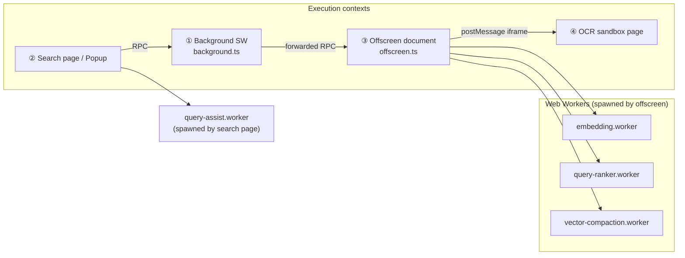
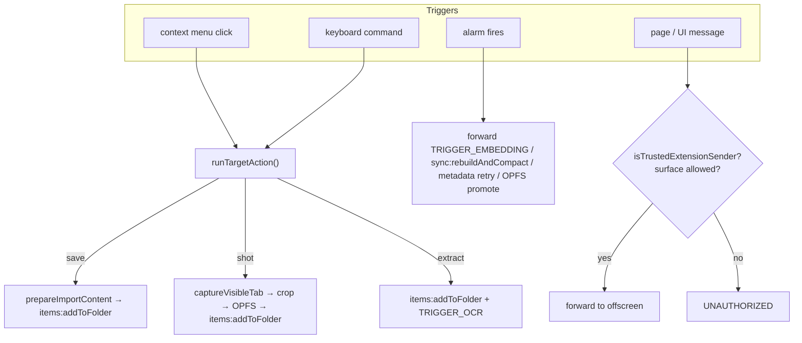
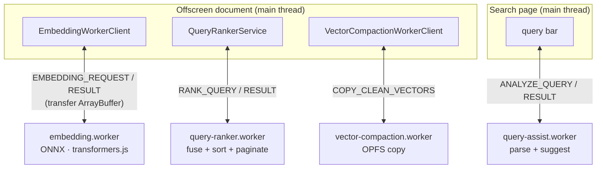

# Workers & Execution Contexts

Vibesearch runs across several JavaScript contexts. Some are required by the browser-extension
model (a background worker, an offscreen document), and some are deliberate choices to keep the
UI responsive and to satisfy the Content Security Policy. This page catalogs each one: **why it
exists, what runs in it, and how it communicates.**

> See [the overview](README.md) for how these contexts fit together. This page zooms in on
> each, with special attention to the four dedicated **Web Workers**.

## The map



## Contexts at a glance

| Context | Lifetime | Has DOM? | CSP | Primary job |
| --- | --- | --- | --- | --- |
| Background service worker | Ephemeral (killed when idle) | No | strict | Chrome APIs, routing, alarms, metadata |
| Search page / popup (UI) | While open | Yes | strict | Render; send RPC; autocomplete |
| Offscreen document | Persistent (kept alive) | Yes | strict | DB, indexes, vector store, pipelines |
| OCR sandbox page | While iframe attached | Yes | **loose** (`unsafe-eval`, `blob:`) | Run the OCR model |

---

## ① Background service worker — `src/workers/background.ts`

The MV3 entry point. It's a **stateless router and orchestrator**, not a data store.

**Owns the Chrome surface:**
- **Context menus** — Save image/video/link/quote/page, "Extract text from image", screenshot
  (visible / region), "Import shared VibeSearch link", and a "Save to…" submenu built from your
  spaces/folders plus recently-used (LRU) folders. Rebuilt on a debounced schedule (180ms for
  high-priority changes, ≥2.5s apart otherwise).
- **Commands / shortcuts** — `quick-save` (`Ctrl/Cmd+Shift+S`) and `take-screenshot`
  (`Ctrl/Cmd+Shift+Y`) reuse the exact same code path as the matching context-menu action so
  behavior is identical. `_execute_action` (`Ctrl/Cmd+Shift+E`) opens the popup — that's a
  built-in Chrome behavior with no handler.
- **Alarms** — the cron table (`embedding-alarm` 5m, `vector-sync-alarm` 6h,
  `metadata-retry-alarm` 30m, `opfs-promote-alarm` 30m).
- **Screenshots** — `chrome.tabs.captureVisibleTab`, plus a region selector injected with
  `chrome.scripting.executeScript`, then cropped and stored to OPFS.
- **The metadata pipeline** — see [import.md](import.md).

**Owns no data.** For anything stateful it forwards an RPC to the offscreen document via
`sendForwardedToOffscreen()`, which first ensures the offscreen document exists.



> **Why a router and nothing more?** The worker is torn down after ~30s idle and respawned on the
> next event. Holding the DB, the vector store, or in-flight queues here would mean losing them
> constantly. So state lives in the offscreen document, which persists.

---

## ② UI contexts — search page & popup

React 19 apps under the strict extension CSP. They hold only view state and talk to the
offscreen document over the RPC bus. The search page is also registered as a
`web_accessible_resource` so it can be opened as a normal tab (and optionally as the new-tab
page, via a background redirect rather than a manifest override — so your native new tab is
untouched when the option is off).

---

## ③ Offscreen document — `src/pages/offscreen/offscreen.ts`

The persistent host for all stateful machinery. Created once with:

```ts
chrome.offscreen.createDocument({
  url: "src/pages/offscreen/offscreen.html",
  reasons: ["WORKERS"],
  justification: "Persistent OPFS access for vector processing",
});
```

It registers each controller with the `OffscreenRouter` behind a **method allowlist**:

```
dbManager · browserBookmarks · githubStars · sync · items · folders
          · tags · spaces · spaceGroups · ocr
```

and it is what **spawns the three Web Workers** below and **owns the hidden OCR iframe**. It
also subscribes to every RxDB `collection.$` change stream to drive incremental index sync and
the background queues. Think of it as the application server that happens to live inside the
browser.

> **Why an offscreen document and not the service worker?** It needs a DOM, OPFS file handles,
> the ability to spawn module Web Workers, and to host an iframe — all things a service worker
> can't reliably do. And it must persist across the worker's death.

---

## ④ OCR sandbox page — `src/pages/ocr-sandbox/`

A `manifest.sandbox` page. The extension's normal CSP is `script-src 'self' 'wasm-unsafe-eval';
worker-src 'self'` — **no `unsafe-eval`, no `blob:` workers.** PaddleOCR's onnxruntime-web
runtime needs exactly those. The sandbox CSP grants `'unsafe-eval'` and `worker-src 'self'
blob:`, so OCR can only run here. It has an opaque origin and communicates by `postMessage`.
Full detail in [ocr.md](ocr.md).

---

# The four Web Workers

All four are plain `Worker`s (off the main thread). Three are spawned by the offscreen
document; one by the search page. They exist to keep CPU-heavy or memory-heavy work from
freezing whatever thread would otherwise run it.



## embedding.worker — `src/services/workers/embedding.worker.ts`

Runs the sentence-embedding model (ONNX via `@huggingface/transformers` on onnxruntime-web).
This is the single most expensive thing in the app, so it gets its own thread.

- **One worker, two priority queues.** The `EmbeddingWorkerClient` keeps an *interactive* queue
  (your live search query) and a *background* queue (bulk import). Interactive always jumps the
  line, and a single worker means ONNX never runs two inferences at once. A search waits at most
  one short background request.
- **Length-aware micro-batching** bounds memory (self-attention scales with
  `batchSize × seqLen²`). At most 8 sentences per pass, bucketed by length.
- **Circuit breaker** — after 2 failed initializations it refuses for 30s instead of hammering
  the model host.

Full detail in [embeddings.md](embeddings.md).

## query-ranker.worker — `src/services/workers/query-ranker.worker.ts`

Takes the lexical scores (FlexSearch) and vector scores (VectorStore), **fuses** them into a
single relevance, applies a recency tie-break, filters, then selects the top window with a
**min-heap** and paginates (offset or cursor). Ranking a large candidate set is pure CPU and
would jank the offscreen thread, so it's offloaded. There's an in-process `rankLocally` fallback
if the worker is unavailable. Full detail in [search.md](search.md#hybrid-ranking).

## vector-compaction.worker — `src/services/workers/vector-compaction.worker.ts`

During [vector maintenance](backup-and-sync.md#vector-maintenance), it copies the still-valid
("clean") vectors out of the old `vectors.bin` into a fresh file. It detects **contiguous runs**
of indexes and copies each run as one big OPFS read+write instead of vector-by-vector. Heavy
OPFS I/O off the main thread; there's an in-process fallback too.

## query-assist.worker — `src/pages/search/workers/query-assist.worker.ts`

The only worker on the **UI** side. It runs `analyzeQuery()` from `search-core/query-language.ts`
on every keystroke — tokenizing your query into filter chips + free text and producing
autocomplete suggestions — using a catalog of your spaces/folders/tags/sources/authors that the
page pushes to it via `SET_CATALOGS`. Keeping the parser off the input thread keeps typing
buttery. Full detail in [search.md](search.md#the-query-language).

---

## Worker scorecard

| Worker | Thread of | Why it's a worker | Message in → out |
| --- | --- | --- | --- |
| `embedding.worker` | offscreen | ONNX inference is CPU/memory heavy | `EMBEDDING_REQUEST` → `EMBEDDING_RESULT` (transferred `ArrayBuffer`) |
| `query-ranker.worker` | offscreen | fuse + sort large candidate sets | `RANK_QUERY` → `RANK_QUERY_RESULT` |
| `vector-compaction.worker` | offscreen | bulk OPFS copy during GC | `COPY_CLEAN_VECTORS` → `…_RESULT` |
| `query-assist.worker` | search page | parse + suggest on every keystroke | `ANALYZE_QUERY` → `ANALYZE_QUERY_RESULT` |

And the two non-Worker satellites that round out the picture:

| Context | Spawned by | Why separate |
| --- | --- | --- |
| OCR sandbox iframe | offscreen | needs `unsafe-eval` + `blob:` workers the extension CSP denies |
| Background SW | the browser | owns Chrome APIs; must stay stateless because it's ephemeral |
